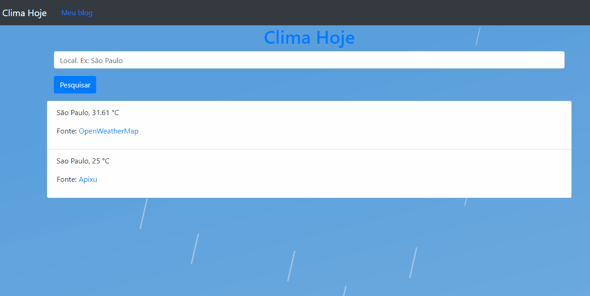

# ClimaHoje
Projeto que busca a temperatura atual de uma cidade determinada no campo de busca.  
Criado em cima do ExpressJs, apenas pra fins estudantis.

### Como usar
Acesse a raiz do projeto.
Rode os comandos `npm install` pra instalar as dependências e depois `npm start`.

